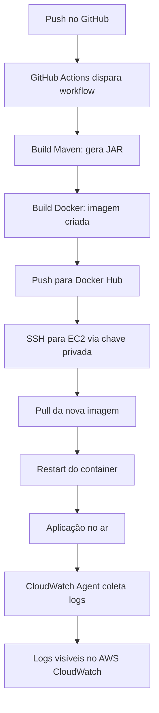

# ☁️ Spring Boot + AWS | Gestão de Arquivos com Deploy Automatizado

[](https://www.oracle.com/java/)
[](https://spring.io/projects/spring-boot)
[](https://aws.amazon.com/)[](https://www.docker.com/)
[](https://github.com/features/actions)
[](LICENSE)


Aplicação Java com Spring Boot para gerenciamento de arquivos em um bucket da AWS S3.  
Suporta **upload**, **download**, **listagem** e **remoção** via API REST — agora com **persistência de metadados no DynamoDB**, integração com **lambda**,**deploy automatizado via GitHub Actions**, containerização com **Docker**, e monitoramento em tempo real com **CloudWatch Logs**.
---

## 🚀 Funcionalidades

- ✅ Upload de arquivos (`multipart/form-data`)
- 📥 Download direto do S3 com `Content-Type` dinâmico
- 📁 Listagem de objetos no bucket
- ❌ Remoção de arquivos específicos
- 🧾 Persistência de metadados no DynamoDB
- 🔍 Consulta de registros via chave primária
- ⚡ Integração com AWS Lambda para processamento assíncrono
- 🔐 Autenticação segura via `DefaultCredentialsProvider`
- 🐳 Deploy automatizado com GitHub Actions + EC2
- 📡 Logs em tempo real enviados para AWS CloudWatch

---

## 🛠️ Tecnologias Utilizadas

| Camada         | Tecnologias                          |
|----------------|--------------------------------------|
| Backend        | Java 17+, Spring Boot                |
| Build          | Maven                                |
| Cloud Storage  | AWS S3, AWS SDK for Java v2          |
| Banco NoSQL    | Amazon DynamoDB                      |
| Serverless     | AWS Lambda                           |
| Containerização| Docker                               |
| CI/CD          | GitHub Actions, Amazon EC2 (Linux)   |
| Monitoramento  | Amazon CloudWatch Logs               |
| Testes         | Postman, curl                        |                 |

---

## ⚙️ Configuração

### `application.yml`

```yaml
aws:
  region: sa-east-1
  bucket: java-arquivos-ale

```

## 🔄 Pipeline Automatizada

A aplicação conta com uma pipeline CI/CD completa, que garante deploy contínuo e monitoramento em tempo real:



## 📘 Licença

Este projeto está sob a licença MIT. Sinta-se livre para usar, modificar e contribuir.

---

## 👨‍🚀 Autor

**Alexandre Webmaste**  
Desenvolvedor Java | Cloud Enthusiast | DevOps Explorer  
[GitHub](https://github.com/alewebmaste) • [LinkedIn](https://www.linkedin.com/in/borbabackend/)

